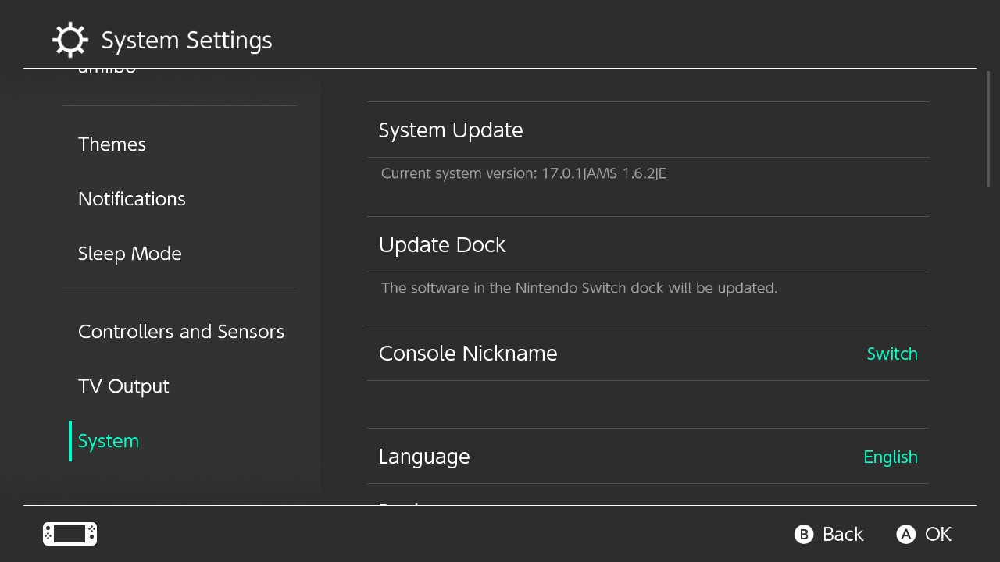

# Launching CFW

Now that the preparation work is out of the way, we're finally ready to launch custom firmware on the Switch.

Unlike systems such as the DSi, Wii, or 3DS, Switch CFW is currently volatile. It will only work as long as your Switch is on. As soon as your Switch completely loses power for any reason (shutting down, battery dying, etc.), CFW will no longer be active and you will need to follow these instructions again.

!!! danger "Keep emuMMC offline at all times"
    Your emuMMC (emuNAND) should never connect to Nintendo. For online play, eShop browsing, or any other Nintendo online activity, use your sysNAND. Using both emuMMC and sysNAND online will likely result in a ban.

=== "Instructions for emuMMC"

    1. From hekate's `Home` menu, navigate to the `Launch` menu.
    2. Find `Atmosphere FSS0 emuMMC` and launch it.

    Hekate is now booting into your emuMMC. To verify that your emuMMC launched properly, open System Settings and navigate to System. You should see `AMS` next to the version number (`AMS` indicating that you're booted into Atmosphere), as well as an `E` at the end (indicating you are booted into emuMMC).

    

=== "Instructions for sysCFW"

    1. From hekate's `Home` menu, navigate to the `Launch` menu.
    2. Find `Atmosphere FSS0 sysMMC` and launch it.

    Hekate is now booting into sysCFW. To verify that sysCFW launched properly, open System Settings and navigate to System. You should see `AMS` next to the version number (`AMS` indicating that you're booted into Atmosphere), as well as an `S` at the end (indicating you are booted into sysCFW).

    

&nbsp;

!!! tip "Rebooting to Hekate"
    Once booted into CFW, you can easily get back to Hekate by holding the power button, and selecting `Restart` in the power menu or by using the "reboot to payload" homebrew app in the homebrew menu. (Note that the reboot to payload app does *not* work on modchipped Switch consoles)

### **Launching the Homebrew Menu**

You will now be able to launch the Homebrew Menu by opening the album or by holding the R button while launching any game (including demos/cartridges), or application (e.g. Youtube/Hulu). If R is not held, the game or application will launch like normal.

!!! warning "A note about using the album for the Homebrew Menu"
    - Using the album for the Homebrew Menu instead of a game or application has several limitations, including but not limited to: a smaller amount of available memory (RAM), as well as being unable to launch a full-featured web browser. It is strongly recommended to launch homebrew through applications or games instead.

### **What the included homebrew applications do**

- JKSV is a save manager, it can dump and restore saves from/to your system. For more information, see [Save Management](../../extras/save_management.md)

- FTPD is a ftp tool for connecting your Switch's microSD card wirelessly to your PC. Tools like WinSCP can connect to your Switch on `(ip of Switch):5000`

- NX-Shell is a file explorer for the Switch. You can move files, listen to mp3's, view images etc.

- NXThemeInstaller is a theme installer app. See the [Theming section of our guide](../../extras/theming.md) for more information

If you wish to install more homebrew apps, place them (`.nro` files) in the `switch` folder on your microSD card.

### **Installing Android/Linux**

If you've partitioned your microSD card for preparation of Android/Linux earlier, you can continue with the installation of Android/Linux here with the guides below:

[Android installation guide :material-arrow-right:](../../extras/installing_android.md){ .md-button .md-button--primary } [Linux installation guide :material-arrow-right:](../../extras/installing_linux.md){ .md-button .md-button--primary }
