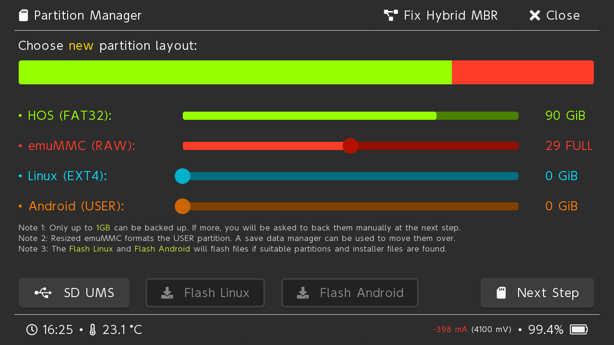

# Partitioning the SD Card and creating the emuMMC

!!! warning "This will delete everything on your sd card"
	Doing this will delete all your data from your sd card, be warned! Back up your `Nintendo` folder (if you used your SD card for game storage already) and any other folders/files on the root of your SD card beforehand using the instructions below.
    The Nintendo folder contains downloaded necessary game data (the data required for games to actually run). You will need to copy the Nintendo folder to `SD:/emuMMC/RAW1/` after creating the emuMMC.

-----

### **What you need:**

- Your switch loaded into Hekate

### **Instructions:**

1. From hekate's `Home` menu, navigate to `Tools` > `USB tools` > `SD card` and plug your Switch into your PC via USB. 
    - Your SD card should now be accessible on your PC, if not, consult the warning message below.
2. Back up your `Nintendo` folder and any other important data to your PC.
3. Safely eject the `UMS` device from within the operating system of your PC, then return to hekate's `Home` menu.
4. Navigate to `Tools` > `Partition SD card`
5. Set the `emuMMC (RAW)` slider to `29 FULL` in the middle of the bar.
    - Set the `emuMMC (RAW)` slider to `58 FULL` if you're on an OLED Switch.
    - If you wish to install Android and/or Linux later, partition your SD card here accordingly by moving the sliders you see during this step. We recommend setting the `Android (USER)` and `Linux (EXT4)` sliders to 16GB minimum.
6. Navigate to `Next Step` at the bottom right, then select `Start` in the menu that appears.
7. From hekate's `Home` menu, navigate to `emuMMC` > `Create emuMMC` > `SD Partition` > `Part 1` and wait for hekate to complete creating the emuMMC.
8. Close the emuMMC creation menu by navigating to the `Close` button, then navigate to `Change emuMMC` > `SD RAW 1` and press the `Close` button twice in the top right to return to hekate's `Home` menu.
9. Once done, go to `Tools` > `USB tools` > `SD card` and plug your Switch into your PC via USB.
10. Continue with the next step of the guide. 
     - Your SD card should now be accessible on your PC, if not, consult the warning message below.

!!! warning "Your SD card is not showing up or Windows complaining about an unreadable drive"
    If you get the issue that Windows says the SD card is unreadable and wants to format it, do not format! This is likely your emuMMC partition. After partitioning your SD, your SD will show up as 2 drives on your PC. Use the accessible drive.
    If your SD card isn't showing up at all, ensure that you're using a USB cable capable of data transfer and that, if you use Windows, Windows has assigned a drive letter to the FAT32 partition of your SD. If you still experience errors, join the <a href="https://discord.gg/C29hYvh" target="_blank">NH Discord server</a> for support.

&nbsp;

[Continue to SD Preparations :material-arrow-right:](sd_preparation.md){ .md-button .md-button--primary }
